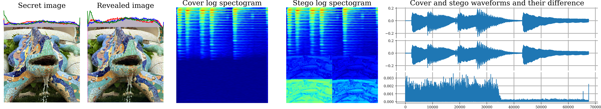
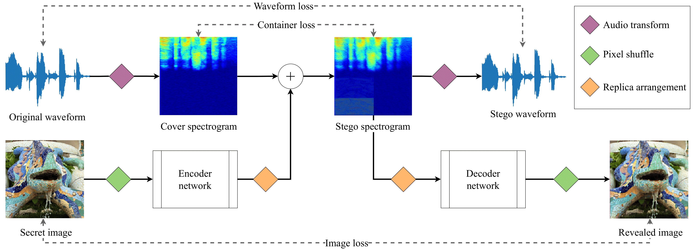

# PixInWav 2

Code for _PixInWav 2_'s _StegoUNet_, a deep neural network capable of hiding color images inside audio signals.



The system converts the audio waveform to its spectral representation and adds the preprocessed image residually; the decoder is then able to extract the image. All this while introducing minimal distortion in the audio container and the secret image.




## Differences with respect to PixInWav 1

This project evolved from the original [PixInWav](https://github.com/margaritageleta/PixInWav) codebase. It has been rewritten from scratch, but expect much overlap with the original code. The main differences in the code are listed in this section.

### New features
* Implementation of the STFT as an alternative to STDCT. Several options exist to choose which host signal to use (magnitude, phase or both) and control the architecture when using magnitude and phase together.
* New architectures and possibilities for embeddings, controlled through flags.
* Implemented alternative architectures to the default _Stretch_: _Replicate_ (`blocks`), _W-Replicate_ (`blocks2`), _WS-Replicate_ (`blocks3`) and _multichannel_.
* Possibility of permuting the preprocessed image before adding it into the spectrogram and unpermuting before revealing.
* STFT can be made larger to obtain more container capacity.
* Possibility to embed the luma channel alongside the RGB values when pixel-shuffling.
* Possibility of using batch sizes > 1 when using STFT.

### Dropped features
* Old architectures that were shown to be worse than the default _resindep_ in PixInWav.
* Possibility to add noise on the transmitted signal.
* Support for grayscale images. Everything is RGB now.

### Other changes
* The waveform loss function by default uses the L1 distance instead of soft DTW.
* Tidier output during training. It is now easier to follow the progress from the log files.
* Validation plots are different when using STDCT or STFT (with magnitude, phase or both).
* Flags for controlling STFT magnitude and phase have changed, to allow for the possibility of having magnitude and phase together.
* Validation steps are less frequent and shorter (can be controlled through flags). Training is ~10x faster by default.
* Number of training epochs is now a flag.
* Change the way data files are loaded. Structure of environment variables is more intuitive.
* Zero-pad shorter audios randomly on either side.
* Batch norm has been removed from the network.


## Repository outline
All the code files are in the `src` directory:
* `main.py`: script to run the overall training process.
* `umodel.py`: the complete model definition with all possible different architectures.
* `train.py`: responsible for the training and validation of the given model.
* `loader.py`: loader script to create the data set from the images and audios.
* `losses.py`: losses and metrics for training and validation. Uses a [courtesy script](https://github.com/Po-Hsun-Su/pytorch-ssim) to compute the SSIM metric.
* `pystct.py`: [courtesy script](https://github.com/jonashaag/pydct) to perform the STDCT on an audio waveforms.
* `pydtw.py`: [courtesy script](https://github.com/Sleepwalking/pytorch-softdtw) to compute the SoftDTW for two audio waveforms.
* `visualization.py`: functions for plotting the validation results during training.

In the `scripts` directory there are helper shell scripts:
* `srun_train.sh`: a wrapper for running a training experiment. Hyperparameters are defined at the top and logs are handled automatically.
* `imagenet_sampler.sh`: the script used to randomply sample the whole Imagenet dataset to only 15 images per class (note that the loader further samples to only 10 images per class), greatly reducing the dataset size.


## Installation

### Requirements
A list of Python dependencies is listed in `requirements.txt`. They can be installed with pip: `pip install -r requirements.txt`.

### Data
We use the following datasets:
* [ImageNet](http://image-net.org) (ILSVRC2012). We use 10,000 images for training and 900 images for validation. Images are cropped to 256x256 resolution. Dataset labels are ignored.
* [FSDNoisy18K](http://www.eduardofonseca.net/FSDnoisy18k/) which has 17584 audios for training and 946 audios for validation. Audios are randomly cut (or zero-padded) to a fixed length (~1.5s).

> Note: the full ImageNet dataset is >150GB in size, but we only use a fraction of it (10 images per class). We recommend using our `imagenet_sampler` script to generate a subset prior to training the model. It also restructures the directories as the loader expects.


### Environment variables

The following environment variables define input and output directories. They need to be defined prior to training:
* `USER_PATH`: absolute path to the folder of the _PixInWav2_ directory (i.e. the one that contains _src_).
* `OUT_PATH`: absolute path where all output will be written to (logs & checkpoints).
* `DATA_PATH`: absolute path where the two data sets are located.

The data directory is assumed to have the following structure:
```
<root directory pointed by DATA_PATH>/
├── FSDnoisy
│   ├── FSDnoisy18k.audio_test
│   │   ├── 101383.wav
│   │   ├── 101489.wav
│   │   └── ...
│   └── FSDnoisy18k.audio_train
│       └── ...
└── imagenet
    ├── ILSVRC
    │   └── Data
    │       └── CLS-LOC
    │           └── train
    │               ├── n01440764
    │               │   ├── n01440764_10162.JPEG
    │               │   ├── n01440764_11346.JPEG
    │               │   └── ...
    │               ├── n01443537
    │               │   └── ...
    │               └── ...
    └── mappings.txt

```


## Usage
We recommend running the training process through the `srun_train` script. However, it can also be run manually by calling the `main.py` source file. The different hyperparameters are controlled through flags:

### Generic flags
* `experiment <int>` sets the experiment number, which will be used when saving/loading checkpoints.
* `summary <string>` gives a name to the current experiment that will be shown in Weights and Biases.
* `output <path>` specifies a text file where the stardard output should be printed.
* `from_checkpoint <true|false>` allows loading an existing model from a checkpoint instead of starting the training process anew. Checkpoints are created automatically during training.

### Training hyperparameters
* `lr <float>` sets the learning rate.
* Use `val_itvl <int>` and `val_size <int>` to control after how many training iterations to perform validation and how many validation iterations should there be.
* Use `num_epochs <int>` and `batch_size <int>` to easily tweak the number of training epochs and the batch size.

### Loss hyperparameters
* `beta <float [0..1]>` and `lambda <float>` control the tradeoff between audio and image quality. If using both STFT magnitude and phase, `theta <float [0..1]>` weights the importance of each of the two containers.
* `dtw <true|false>` use the soft DTW to compute the waveform loss (otherwise use the L1 distance).

### Audio transform
* `transform <cosine|fourier>` is used to choose between STDCT or STFT. Note that STDCT is mostly obsolete and some of the most recent features do not support it.
* `stft_small <true|false>` allows using the default 'small' STFT container (1024x512) or a larger one (2048x1024).
* `ft_container <mag|phase|magphase>` selects which STFT container to use: magnitude, phase or both. Only if using STFT.

### STFT magnitude+phase
* `mp_encoder <single|double>` and `mp_decoder <unet|double>` allow choosing between multiple architectures that use the STFT magnitude and phase at the same time.
* `mp_join <mean|2D|3D>` specifies the joining operation to use when revealing separately the magnitude and the phase.

### Other flags
* `permutation <true|false>` specifies whether or not to permute the signals after preprocessing and before revealing.
* `embed <stretch|blocks|blocks2|blocks3|multichannel>` is used to choose between multiple embedding methods. Only tested when using Fourier magnitude.
* `luma <true|false>` includes the luma value of the pixel during pixel-shuffle.

## License

**NOTICE**: This software is available for use free of charge for academic research use only. Commercial users, for profit companies or consultants, and non-profit institutions not qualifying as *academic research* must contact `jaume.ros.alonso@estudiantat.upc.edu` AND `geleta@berkeley.edu` for a separate license. 
